<!-- Please do not change this logo with link -->

[](https://www.microchip.com)

# Getting Started With the 8-Bit MDFU Client for PIC16F18446 Using MPLAB® X

This example demonstrates how to utilize the MPLAB Code Configurator (MCC) generated code to set up various basic Microchip Device Firmware Update (MDFU) bootloader solutions for the PIC16F18446 Curiosity Nano Evaluation board.

The MDFU is a firmware update system that employs a device-independent host application to update application firmware. The application image loaded into the host adheres to a custom file format, incorporating device and application-specific parameters necessary for the update. This repository offers a foundational setup to configure and customize the MCC Melody 8-Bit MDFU Client library on the PIC16F18446 Curiosity Nano Base for Click boards™, along with instructions for executing the examples.

This example demonstrates:
- How to configure the 8-Bit MDFU Client Library in MCC Melody for different verification schemes
- How to create a simple Blinky LED application
- How to use the [`pyfwimagebuilder`](https://pypi.org/project/pyfwimagebuilder/) command line interface to convert the application hex file into an application image
- How to use the [`pymdfu`](https://pypi.org/project/pymdfu/) command line interface to update the application firmware

## Related Documentation

- [PIC16F18446 Family Product Page](https://www.microchip.com/en-us/products/microcontrollers-and-microprocessors/8-bit-mcus/pic-mcus/pic16f18446)
- [8-Bit MDFU Client v1.1.0 Release Note](https://onlinedocs.microchip.com/v2/keyword-lookup?keyword=RELEASE_NOTES_8BIT_MDFU_CLIENT_LIBRARY&version=latest&redirect=true)
- [Getting Started Document, API Reference and Update Image Specification](https://onlinedocs.microchip.com/v2/keyword-lookup?keyword=8BIT_MDFU_CLIENT&version=latest&redirect=true)
- [8-Bit MDFU Client Known Issues List](https://onlinedocs.microchip.com/v2/keyword-lookup?keyword=KNOWN_ISSUES_8BIT_MDFU_CLIENT&version=latest&redirect=true)

## Software Used

- [MPLAB® X IDE 6.20.0](https://www.microchip.com/en-us/development-tools-tools-and-software/mplab-x-ide?utm_source=GitHub&utm_medium=TextLink&utm_campaign=MCU8_MMTCha_MPAE_Examples&utm_content=pic16f18446-cnano-8bit-mdfu-client-mplab-mcc-github)
- [MPLAB® XC8 2.50.0](https://www.microchip.com/en-us/development-tools-tools-and-software/mplab-xc-compilers?utm_source=GitHub&utm_medium=TextLink&utm_campaign=MCU8_MMTCha_MPAE_Examples&utm_content=pic16f18446-cnano-8bit-mdfu-client-mplab-mcc-github)
- [MPLAB® Code Configurator (MCC) 5.5.1](https://www.microchip.com/mplab/mplab-code-configurator)
- [MPLAB® Code Configurator (MCC) Device Libraries PIC10/12/16/18 microcontrollers (MCUs)](https://www.microchip.com/en-us/tools-resources/develop/libraries/microchip-libraries-for-applications)
- [Python 3.8 or later](https://www.python.org/downloads/)
- [pyfwimagebuilder v1.0.1](https://pypi.org/project/pyfwimagebuilder/)
- [pymdfu v2.4.0](https://pypi.org/project/pymdfu/)

## Hardware Used

- PIC16F18446 Curiosity Nano [(DM164144)](https://www.microchip.com/en-us/development-tool/DM164144)

[](images/190702-MCU8-PHOTO-DM164144-Front-Transparent_crop.png)

## Setup
The following project setup steps will demonstrate the basic configuration steps for setting up the 8-Bit MDFU Client with Universal Asynchronous Receiver and Transmitter (UART) communication. The configuration bits, clock, Non-Volatile Memory (NVM), and General Purpose Input/Output (GPIO) settings will be consistent across all examples in this repository and any deviations from this setup due to the chosen communication protocol will be described individually later in this section.

### Bootloader Client Setup
[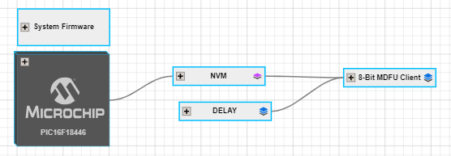](images/ProjectConfigurationOverview.PNG)

**Configuration Bits**
- External Oscillator Selection bits: Oscillator not enabled
- Reset Oscillator Selection bits: HFINTOSC (1MHz)

[](images/ConfigBitsSetup.PNG)

**Clock Control**
- Clock Source: HFINTOSC
- HF Internal Clock: 4_MHz

*For CRC16 and CRC32 the Clock is set to 32_MHz*

- Clock Divider: 1

[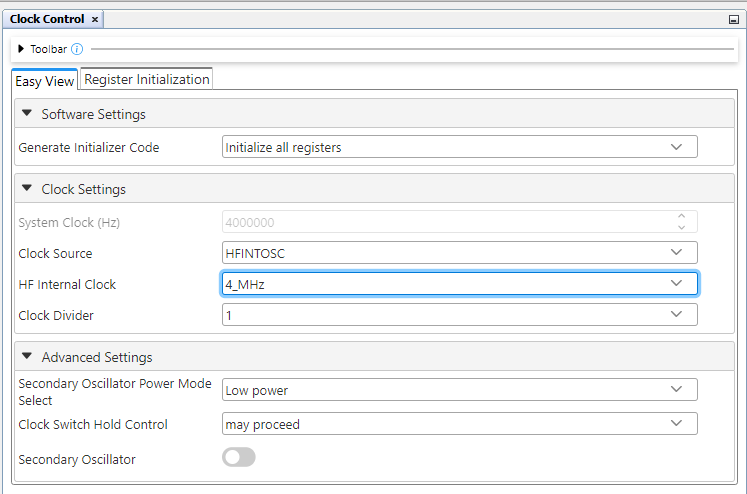](images/ClockSetup.PNG)

**NVM**
- Generate Flash APIs: Enabled
- Generate Device ID APIs: Enabled

[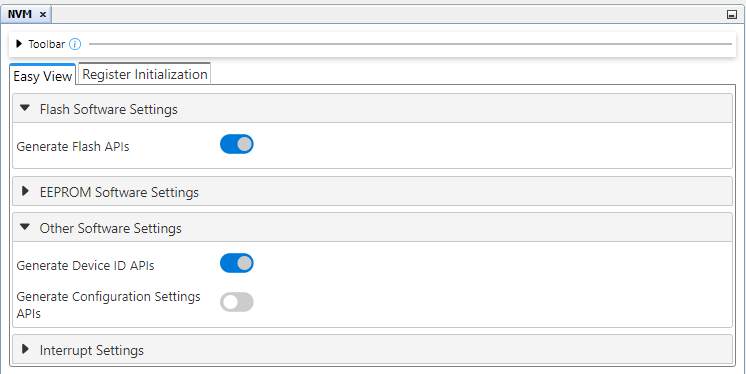](images/NVMSetup.PNG)

**8-Bit MDFU Client**

This section will guide you through the setup process for UART communication. For more details on configuring and operating other communication protocols, please refer to the pages listed below
- [SPI Communication](pic16f18446-spi/Readme.md)

**8-Bit MDFU Client with UART Communication**

- Communication Protocol: UART
- Application Start Address: Different for each project based on the verification selected
- Device ID: 0x30D4 (automatically added)
- I/O Pin Indicator: Enabled
- I/O Pin Entry: Enabled
- Memory Verification: Assigned based on the example project naming convention

> **Tip**: This example is for Checksum verification.

[](images/MDFUClientSetup.PNG)

**UART**
- Custom Name: SERCOM
- Requested Baudrate: 9600
- Calculated Baudrate: 9615
- Baud Rate Error (%): 0.16
- Parity: None
- Data Size: 8
- Stop Bits: 1
- Flow Control Mode: None
- Redirect Printf to UART: Disabled
- Interrupt Driven: Disabled

[](images/UARTDriverSetup.PNG)

**EUSART PLIB**
- Actual Baud Rate: 9615.385
- Baud Rate Error (%): 0.16
- Receive Enable: Enabled
- Clock/Transmit Polarity: Non-Inverted
- Serial Port Enable: Enabled
- Transmit Enable: Enabled

[](images/UARTPLIBSetup.PNG)

**UART Pins**
- EUSART TX: RB4
- EUSART RX: RB6

[](images/UARTPortsSetup.PNG)

**8-Bit MDFU Client I/O**

Upon enabling both I/O Options from the 8-Bit MDFU Client module, the INDICATE and ENTRY pin rows will be automatically loaded in the **Pin Grid View** tab. 

Configure these pins as follows:
- BOOT INDICATE: RA2
- BOOT ENTRY: RC2

[](images/IOPortSetup.PNG)
- BOOT INDICATE: Start High
- BOOT ENTRY: Weak Pullup

[](images/IOPinsSetup.PNG)

**8-Bit MDFU Client Project Properties**

> **Tip**: These values can be copied from the "Linker Options" section of 8-Bit MDFU Client MCC UI.

- ROM Ranges: This option is configured based on the start address of the application
- For example, if the application starts at 0xD00 then this value will reflect as `00-7FF,800-CFF`

[](images/ProjectProperties.PNG)

---
### Application Setup
This section is consistent for any example created in this repository.

[](images/AppConfigurationOverview.PNG)


**Clock And Configuration**
- Set the clock and configuration bits to the same values that were set in the MDFU Client

[](images/ClockSetup.PNG)

[](images/ConfigBitsSetup.PNG)

**I/O Pins**
- GPIO Input: RC2
    - Custom Name: BTN
    - Weak Pullup: Enabled
- GPIO Output: RA2
    - Custom Name: LED

[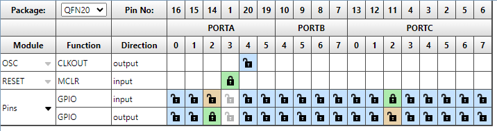](images/AppPortSetup.PNG)

[](images/LEDSetup.PNG)

**Project Properties**

Linker Additional Options
- Codeoffset: 0x<APP_START> = 0xD00
- Checksum: Dependent on the verification scheme

Check the table below to understand how the Checksum option must be configured in the application projects:

[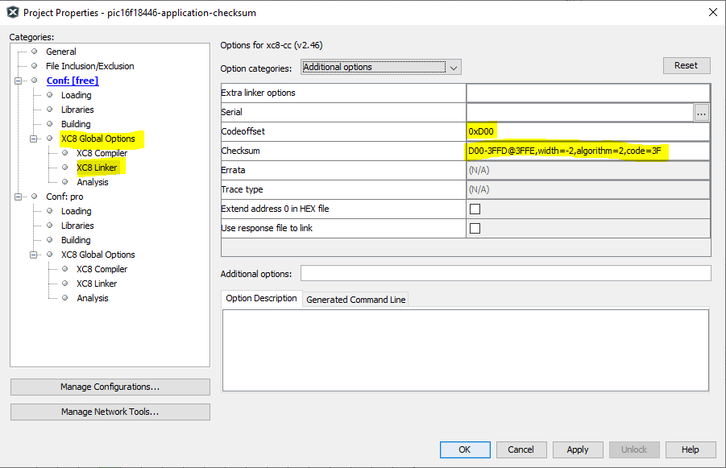](images/AppOffset.PNG)

|Verification Scheme | Checksum Setting |
|---- |---- |
|Reset Vector | N/A |
|Status Byte | N/A |
|Checksum | D00-3FFD@3FFE,width=-2,algorithm=2,code=3F |
|CRC-16 | D00-3FFD@3FFE,width=-2,algorithm=5,offset=FFFF,polynomial=1021,code=3F |
|CRC-32 | E00-3FFB@3FFC,width=-4,algorithm=-5,offset=FFFFFFFF,polynomial=04C11DB7,code=3F |

Fill Flash Memory
- Which area to fill: Provide Range to fill
- How to fill it: Constant or incremental value
- Constant: 0x3FFF
- Increment/Decrement: No Incrementing
- Memory address range: 0x<APP_START>:0x<FLASH_END> = 0xD00:0x3FFF

[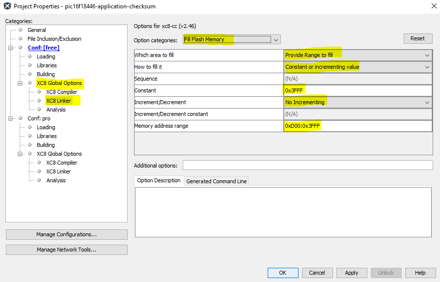](images/AppFill.PNG)

**End Application**

 * Open `main.c`
 * Add logic inside the while loop to toggle the onboard LED with a 200 ms rate
 * Add logic under that to reset the device if the BTN is pressed
```
while(1)
{    
    LED_Toggle();
    DELAY_milliseconds(200U);

    if (BTN_GetValue() == 0U)
    {
        RESET();
    }
}
```

 * Include the `delay.h` header file
 * At the top of the main file before the main function, copy and paste the following code:

 > **Tip**: The address presented below in the __at() is PROGMEM_SIZE - 2 since the hash size used is two bytes. In case of CRC32, the 0xFFFF at the end will be 0xFFFFFFFF, since CRC32 requires four bytes instead of two.

```
#include <stdint.h>
#ifdef __XC8__
#include <xc.h>
#endif

volatile const uint16_t
#ifdef __XC8__
__at(0x1FFFE)
#endif
applicationFooter __attribute__((used, section("application_footer"))) = 0xFFFF;
```

## Operation
In this section, we will walkthrough how to run the examples in this repository. This example shows how to execute the Checksum verification example and update the device Flash memory with the checksum application image to demonstrate a successful device firmware update (DFU) using UART communication. For additional communication protocol operation information, refer to the pages listed below:
- [SPI Example Operation](pic16f18446-spi/Readme.md#operation)

**8-Bit MDFU Client Operation**

1. Open the MDFU client project.

[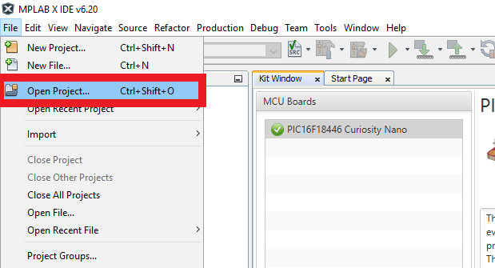](images/openBtnMDFU.png)

[](images/openProjectMDFU.png)

2. Set MDFU client project as Main Project.

[](images/setAsMainProject.png)

3. Right click, then select Clean and Build.

[](images/CleanAndBuildMDFU.png)

4. Program the MDFU client project.

[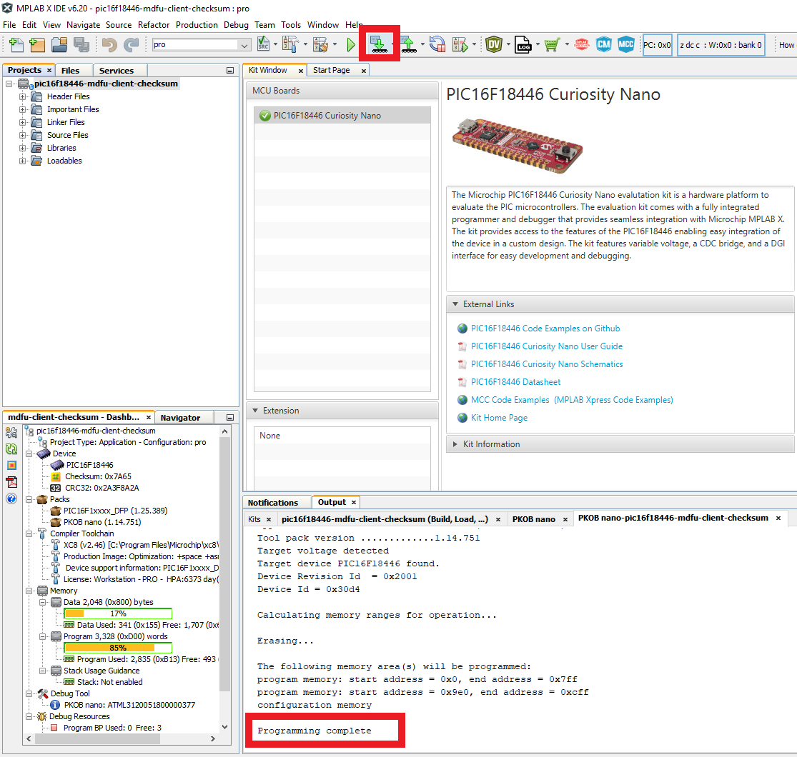](images/ProgramMDFU.png)

**Bootloader Operation After Initial Programming**

After the initial programming, the LED must be on.

[](images/PIC16F18446_BootMode.png)

**Application Operation**
1. Open the application project that is configured for your selected verification scheme.

[](images/openBtnApp.png)

[](images/openProjectApp.png)

2. Set the application project as the Main Project.

[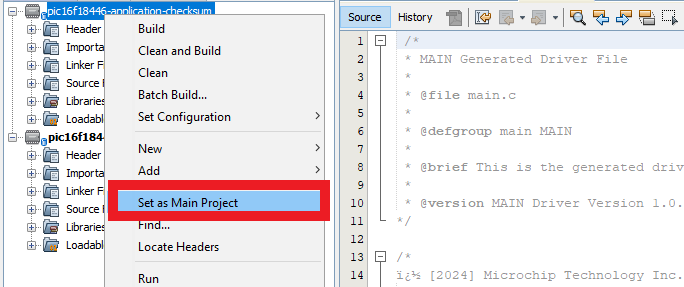](images/setAppAsMainProject.png)

3. Build the required Application project.

Right click, then select **Clean and Build**

[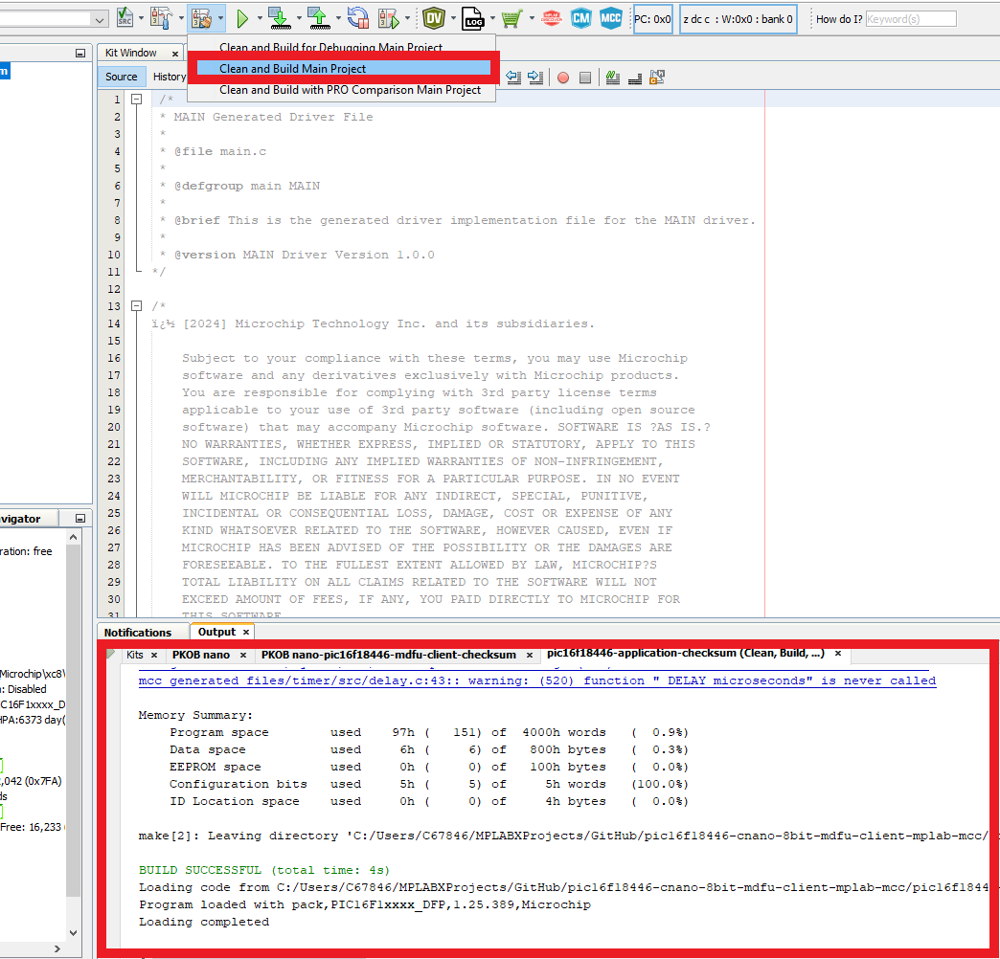](images/CleanAndBuildApp.png)

4. Build the Application Image File using [pyfwimagebuilder](https://pypi.org/project/pyfwimagebuilder/).

- To build the application image files, navigate to the Projects tab and right click *Important Files>`build_free_image.bat`* for Windows or *Important Files>`build_free_image.sh`* for Mac and Linux
- Select Run

[](images/RunBuildScript.png)

**Example Command:**

Below is an example of the command used in the above step.

`pyfwimagebuilder build -i "application_hex_file.hex"  -c "mdfu_config_file.toml" -o output.img`

[](images/BuildTheImage.PNG)

> **Tip**: The configuration TOML file is generated by the MDFU Client project.*

[](images/ConfigPathExample.PNG)

5. Use the [pymdfu](https://pypi.org/project/pymdfu/) host tool to transfer the application image file to the bootloader.

> **Tip**: You can find the COM port of the MCU using the MPLAB Data Visualizer.*

- To run the update with the examples, navigate to the project tab and right click, *Important Files>`pymdfu_update.bat`* for Windows or *Important Files>`pymdfu_update.sh`* for Mac and Linux. Double click to open the file.
- Edit the port number to the CDC port name that is assigned to the Curiosity Nano device
- Then right click on the script and select Run

[](images/runUpdateScript.PNG)

**Example Command:**

Below is an example of the command used in the above step.

`pymdfu update --tool serial --image <application_binary>.img --baudrate <baud_rate> --port <port_name>`

[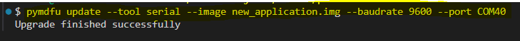](images/SendTheImage.PNG)

**Application Has Been Updated Successfully**

[](images/PIC16F18446_AppMode.gif)

**Example Application Features:**

1. Blink the on-board LED at a rate of 200 ms.
2. Pressing the button on the Curiosity Nano and holding it down will force entry into the bootloader, allowing a new application to be transferred.

## Summary

This repository demonstrates how to configure the 8-Bit MDFU Client library in MCC to enable device firmware updates over UART on a PIC16F18446 Curiosity Nano.

## Contents
- [Back to Related Documentation](#related-documentation)
- [Back to Software Used](#software-used)
- [Back to Hardware Used](#hardware-used)
- [Back to Setup](#setup)
- [Back to Operation](#operation)
- [Back to Summary](#summary)
- [Back to Top](#getting-started-with-the-8-bit-mdfu-client-for-pic16f18446-using-mplab-x)